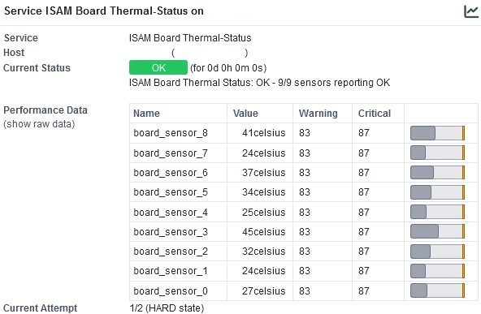
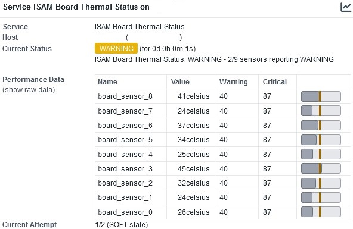
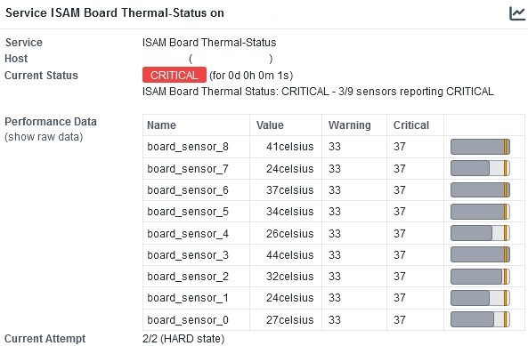

# check_isam_board_temperature

A simple Nagios Plugin to monitor the temperature sensors of Nokia ISAM.


### Description

This script extracts the temperature sensors from Nokia ISAM devices via SNMPv2.
Thresholds can be defined in both directions (high and low temperature).

### Dependencies

- Python 3
- OMD, Check_MK or other Monitoring solutions
- SNMP-enabled OSWP-image installed on the Mgmt-Card (FANT-F)
- SNMPv2 enabled on your Nokia ISAM
  (configure system security snmp community MY-SNMP-COMM host-address MY-MGMT-NET/24)


### Tested on the following systems

- OMD 5.0 (Ubuntu 22) with Python 3.10
- Nokia ISAM 7360 FX-8 (OSWP 6.2) with FANT-F


### Installation

Copying it to your local plugin folder should be enough


### Usage

python3 check_isam_board_temperature.py HOSTNAME SNMPv2-COMMUNITY WARN-HIGH-TEMP CRIT-HIGH-TEMP WARN-LOW-TEMP CRIT-LOW-TEMP


### OMD command and service definition

The command and service definitions for OMD should look something like this:

````
define command {
  command_name                   check_isam_board_temperature
  command_line                   python3 $USER5$/check_isam_board_temperature.py $HOSTADDRESS$ $ARG1$ $ARG2$ $ARG3$ $ARG4$ $ARG5$
}

define service {
  service_description            ISAM Board Thermal-Status
  host_name                      hostname_isam
  use                            service-template-interval-5min
  check_command                  check_isam_board_temperature!MY-SNMP-COMM!80!85!8!5
}
````


### Output








### License

This project is licensed under the GNU General Public License v3.0 License - see the LICENSE.md file for details
